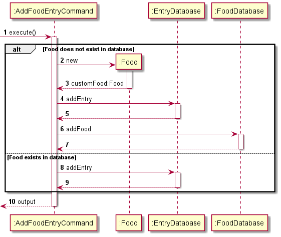
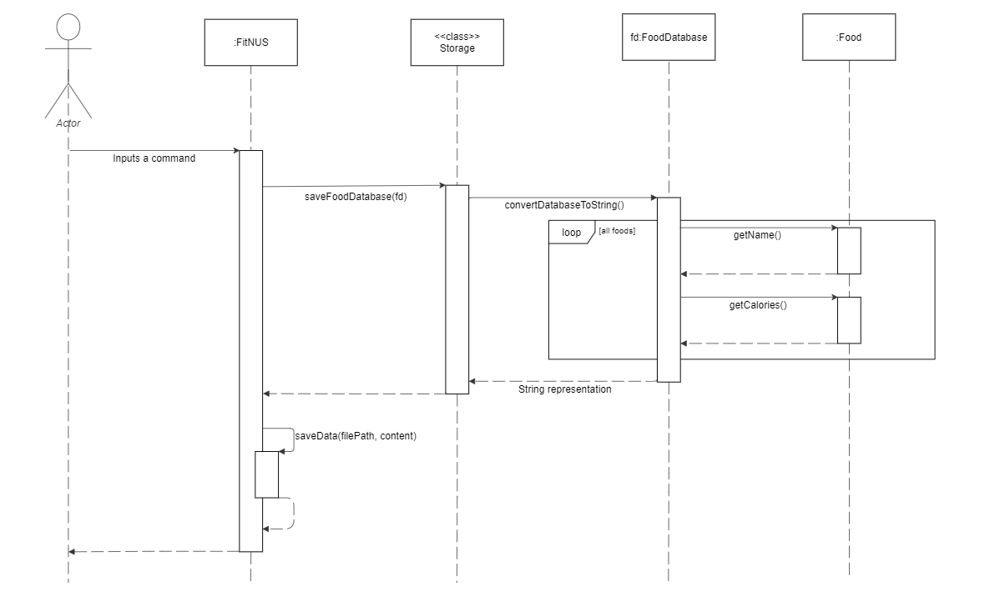

## Add Food Entry Feature
The add food entry mechanism is facilitated by <code>AddFoodEntryCommand</code>. 
It extends <code>Command</code> and stores the data internally into <code>EntryDatabase</code> 
and <code>FoodDatabase</code>. 
Additionally, it implements the following operations:
- <code>EntryDatabase#addEntry(Entry)</code> -- Adds a new entry into the entry database
- <code>FoodDatabase#addFood</code> -- Adds a new food into the food database

## Storage
The Storage class reads and writes data to and from the text file.

### Storage format

- `FoodDatabase`: FOODNAME | CALORIE_VALUE

  @@ -64,15 +64,15 @@ Example:
  1000 | 0

### Implementation
`FoodDatabase`, `EntryDatabase`, and `User` classes each have a method to convert
its data to String format. This String is then saved to the text file.

For instance, when saving the `FoodDatabase` data, `Storage` calls the `convertDatabaseToString()`
method to obtain the String representation of all the data within the `FoodDatabase`. This String is
then written to the text file.

### UML Sequence Diagram
The following sequence diagram describes the operation of the `saveFoodDatabase()` operation.

