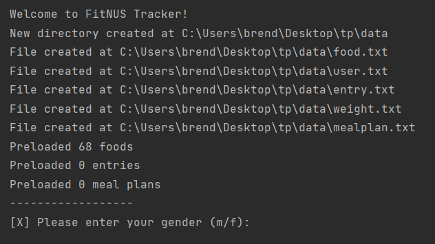
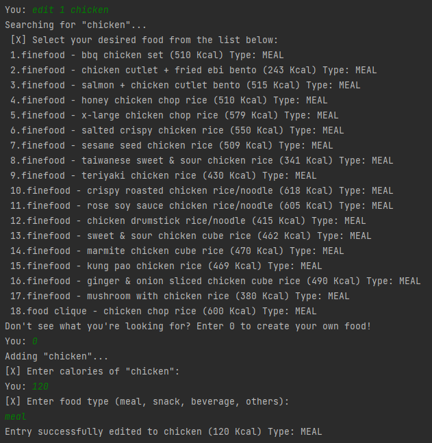
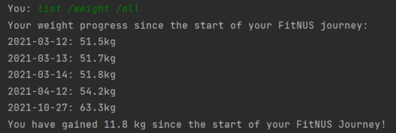
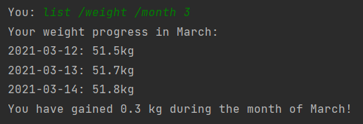
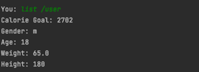
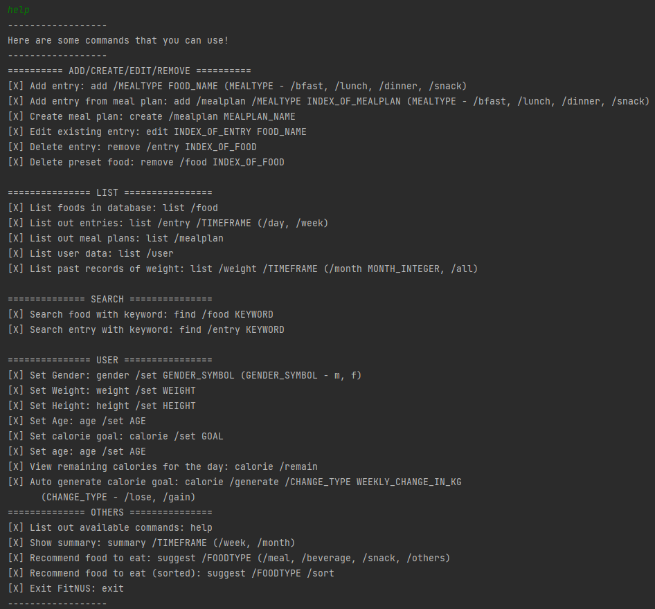
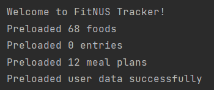

# User Guide

## Introduction

FitNUS is a desktop app for you to track your daily food intake 
in order to maintain a healthy lifestyle and achieve your dietary goals!
FitNUS is tailor-made just for you if you are a computing student 
living in University Town (UTown), as it runs on the Command Line Interface (CLI) 
and comes with a comprehensive built-in database of UTown food for your adding convenience. 
With rich additional functionality such as weight tracking, 
meal plans and calorie goal generation, FitNUS can provide for all of your
health tracking needs and more! 

As a new FitNUS user, you can get started with using FitNUS by using this user guide,
which provides a list of all the features that FitNUS comes with and elaborates
on how each feature works so that you can operate FitNUS with ease. A command summary
is also available at the end of the guide for your quick reference if needed.

Here is the list of sections we will be covering in this user guide. Simply click on 
each heading or subheading in the table of contents to navigate to your desired
section.

- [Notes About the User Guide](#notes-about-the-user-guide)
- [Notes About FitNUS](#notes-about-fitnus)
- [Quick Start](#quick-start)
- [Features](#features)
  - [Entry Database](#entry-database)
    - [Adding food entry: `add`](#adding-food-entry-add)
    - [Adding meal plan entry: `add /mealplan`](#adding-meal-plan-entry-add-mealplan)
    - [Editing existing food entry: `edit`](#editing-existing-food-entry-edit)
    - [Deleting food entry: `remove /entry`](#deleting-food-entry-remove-entry)
    - [Listing food entries: `list /entry`](#listing-food-entries-list-entry)
    - [Searching for food entries with keyword: `find /entry`](#searching-for-food-entries-with-keyword-find-entry)
  - [Food Database](#food-database)
    - [Deleting food: `remove /food`](#deleting-food-remove-food)
    - [Searching for foods with keyword: `find /food`](#searching-for-foods-with-keyword-find-food)
    - [Listing foods in food database: `list /food`](#listing-foods-in-food-database-list-food)
  - [Meal Plan Database](#meal-plan-database)
    - [Creating new meal plan: `create /mealplan`](#creating-meal-plan-by-adding-food-create-mealplan)
    - [Listing meal plan entries: `list /mealplan`](#listing-meal-plan-entries-list-mealplan)
  - [Weight Tracker](#weight-tracker)
    - [Recording weight: `weight /set`](#recording-weight-weight-set)
    - [Listing weight records: `list /weight`](#listing-weight-records-list-weight)
  - [Personalisation](#personalisation)
    - [Setting gender: `gender /set`](#setting-gender-gender-set)
    - [Setting height: `height /set`](#setting-height-height-set)
    - [Setting age: `age /set`](#setting-age-age-set)
    - [Setting calorie goal: `calorie /set`](#setting-calorie-goal-calorie-set)
    - [Generating and setting calorie goal: `calorie /generate`](#generating-and-setting-calorie-goal-calorie-generate)
    - [Viewing remaining calories for the day: `calorie /remain`](#viewing-remaining-calories-for-the-day-calorie-remain)
    - [Viewing user data: `list /user`](#viewing-user-data-list-user)
  - [Other](#other)
    - [Viewing help: `help`](#viewing-help-help)
    - [Viewing statistics: `summary`](#view-statistics-summary)
    - [Getting food suggestions: `suggest`](#getting-food-suggestions-suggest)
    - [Saving data](#saving-data)
    - [Loading data](#loading-data)
    - [Exiting FitNUS: `exit`](#exiting-fitnus)
- [User Stories](#user-stories)
- [Command Summary](#command-summary)

---
## Notes About the User Guide
This guide explains how you can use all the features available on FitNUS and maximises your user experience.

FitNUS was developed with modern-day computing students in mind as our target audience. As a result, users are expected to have a basic level of experience using computers, and preferably, a CLI.

However, do not fret if you have not used a CLI application before, as we have provided an extensive set of instructions to get you started with FitNUS in [this section](#quick-start) below!

Throughout this user guide, we will be using the following styles and terminologies:
- The alert symbol (⚠️) denotes things that you should take note of when using
  FitNUS or reading this user guide.
- Text with a `highlight` indicates code that can be entered by you into the app.
- Text in **bold** indicate important information.

Each command that can be entered by you is accompanied by an example. A screenshot has been provided for every command. The layout of the screenshots provided below is as such:

----- 

## Notes About FitNUS

Due to platform limitations, FitNUS features that allow the user to enter a 
  custom name are unable to handle special characters such as certain symbols
  as well as characters in other languages such as Chinese characters.
  When such characters are detected, FitNUS will omit them from the 
  custom name. Do note that this may result in a blank name field if 
  all characters in the custom name were unable to be handled by 
  FitNUS.

---
## Quick Start

Here are some steps you can take to quickly get started with using FitNUS.
1. Ensure that you have Java 11 installed in your computer.
2. Download the latest version of `fitnus.jar` from [here](https://github.com/AY2122S1-CS2113T-W12-1/tp/releases/tag/V2.1).
3. Copy the file into the folder you want to use as the home folder for FitNUS.
4. Open your terminal, type the following command and then press Enter to run the
program: `java -jar fitnus.jar`
5. If this is your first time using FitNUS (i.e. you have incomplete or missing user data),
   FitNUS will prompt you to set up your user profile by filling in some details.
   If you have successfully run the programme, you should see output similar to the screenshot below:

    

6. Type a command in the terminal and press Enter to execute it. 
e.g. typing help and pressing Enter will show a list of all commands and command formats.

    Some commands you can try to get started:
     - `add chicken`: Lets you find foods with the word "chicken" in them in the
   built-in UTown food database and select a food to add to your food tracker.
     - `list /entry`: Lists all entries in your food tracker.
     - `weight /set`: Records your weight for the day in the weight tracker and updates your weight.
     - `exit`: Exits the app.
7. Refer to the [Features](#features) below for details about each command.

----

## Features

This section details the features that FitNUS is equipped with
and the corresponding commands for each feature. Simply refer to the section
for each command to find out what it does, how to use it and some 
simple usage examples.

> **⚠️ Notes about command format**
> 
> - Words in **UPPER_CASE** are the parameters to be inputted by you,
>
>  e.g. in `add /bfast FOOD_NAME`, FOOD_NAME is a parameter that can be substituted as `add /bfast burgers`.
> - Items in **[Square brackets]** are optional, 
>
>  e.g. `add [/MEALTYPE] FOOD_NAME` can be used as `add /lunch sandwiches` or `add sandwiches`.

&nbsp;

-----

### Entry Database

The entry database is used to store all of your daily food entries. You can
add, edit and delete entries, create custom meal plans for convenient entry adding
and even search for entries using specific keywords. 

#### Adding food entry: `add`
Adds an entry to the entry database. You will also be prompted to fill in 
any additional information if the food you requested was not found in the food database. 

Format: `add [/MEALTYPE] FOOD_NAME`

* The `MEALTYPE` can be of the following 4 types:
  * `bfast` - to denote breakfast
  * `lunch` - to denote lunch
  * `dinner` - to denote dinner
  * `snack` - to denote snacks

> **⚠️ Notes about omitting `MEALTYPE`**
>
> - The `MEALTYPE` will be automatically added based on the current time, if it is not explicitly specified based on the following criteria:
>   - Breakfast: 6am to 10am
>   - Lunch: 11am to 2pm
>   - Dinner: 6pm to 9pm
>   - Snack: Remaining time
> 
> - **If a forward-slash character ("/") is written as the first character of the FOOD_NAME and `MEALTYPE` has not been specified, the app will reject the input!**
>  - Eg. The input `add /rice noodles` will be rejected, whereas the input `add /bfast /rice noodles` will be accepted.

* If there are any pre-set food that matches `FOOD_NAME`, you can do one of the following:
    * Select which food you would like to add
    * Create your own custom food
    
Examples of usage: `add /bfast chicken cutlet`

Sample output:

&nbsp;

#### Adding meal plan entry: `add /mealplan`
Adds a meal plan (i.e. adds several food items) to the entry database.
Make sure to create some meal plans first before using this command! 
Click [here](#creating-meal-plan-by-adding-food-create-mealplan) 
to find out how to create a meal plan.  

Format: `add /mealplan [/MEALTYPE] INDEX_OF_MEALPLAN`

* The `MEALTYPE` can be of the following 4 types:
  * `bfast` - to denote breakfast
  * `lunch` - to denote lunch
  * `dinner` - to denote dinner
  * `snack` - to denote snacks

If a `MEALTYPE` is not specified, FitNUS will automatically tag the meal based on the current time.

> **⚠️ Notes about `INDEX_OF_MEALPLAN`**
>
> - INDEX_OF_MEALPLAN refers to the index of the meal plan(s) shown when command `list /mealplan` is used.
>
> - INDEX_OF_MEALPLAN must be an integer value and within the range shown above.

Examples of usage: `add /mealplan /dinner 1`

Sample output:

&nbsp;

#### Editing existing food entry: `edit`
Edits an existing entry's food information.
This command is especially useful for when you have entered an entry
with the wrong food by mistake!
FitNUS will search for the requested food in the food database 
and update the specified entry's food details accordingly. 

Format: `edit INDEX_OF_ENTRY FOOD_NAME`
> **⚠️ Notes about `INDEX_OF_ENTRY`**
>
> INDEX_OF_ENTRY refers to the index of the entry shown when command `list /entry` is used.

* If any foods in the food database match `FOOD_NAME`, you can do one of the following:
    * Select which food you would like to add
    * Create your own custom food

Example of usage:
`edit 1 chicken`

Sample output:

&nbsp;

#### Deleting food entry: `remove /entry`
Deletes an entry from the entry database.

Format: `remove /entry INDEX_OF_ENTRY`

Example of usage:

`remove /entry 1`

&nbsp;

#### Listing food entries: `list /entry`
Lists out all food entries for a given timeframe.

Format: `list /entry [/TIMEFRAME]`
* The `TIMEFRAME` can be of the following 2 types:
  * `day` - to show entries in the current day
  * `week` - to show entries in the past week

> **⚠️ Notes about omitting `TIMEFRAME`**
>
> When `TIMEFRAME` is omitted, **ALL** available food entries will be listed!

Example of usage:
`list /entry /week`

&nbsp;

#### Searching for food entries with keyword: `find /entry`
Finds all matching entries in the entry database based on the keyword you provided.

Format: `find /entry KEYWORD`

Example of usage:

`find /entry chicken`

&nbsp;

----

### Food Database

The food database is used to store your wide range of foods. You can
delete foods that you don't like, search for those you like, or even just list them all out.

&nbsp;

#### Deleting food: `remove /food`

Deletes a specified food from the food database.

Format: `remove /food INDEX_OF_FOOD`

Example of usage: `remove /food 12`

Sample output:

&nbsp;

#### Searching for foods with keyword: `find /food`

Finds all matching foods in the food database based on the keyword you provided.

Format: `find /food KEYWORD`

Example of usage: `find /food ramen`

Sample output:

&nbsp;

#### Listing foods in food database: `list /food`

Lists out all foods in the food database.

Format: `list /food`

Example of usage: `list /food`

Sample output:

&nbsp;

---- 

### Meal Plan Database

The meal plan database is used to store your very own custom meal plans. Not only can you craft and customise
personalised meal plans, you can also view them all in one glance if you want to.

&nbsp;

#### Creating meal plan by adding food: `create /mealplan`
You can create a custom meal plan by adding existing food items inside the food database to the meal plan. A meal plan consists of a name and a list of food items. 
In order to create a meal plan, you must add at least 1 food item to the plan. Meal plans will allow you to quickly add multiple food items into the entry database.

Format: `create /mealplan NAME_OF_MEALPLAN`

Once a valid `NAME_OF_MEALPLAN` has been added, you will be shown a list of food items inside the database. You will then be prompted to input the indexes of the foods you want to include inside the meal plan. A visual walkthrough has been shown below.

> **⚠️ Notes about `NAME_OF_MEALPLAN`**
>
> `NAME_OF_MEALPLAN` must be at least 1 character long. 
> Pipe Characters ("|") will be automatically removed if included.

> **⚠️ Notes about adding food items to meal plan**
>
> Only valid indexes entered will be parsed. The `index` MUST be an integer value and within the range of food items displayed. Invalid indexes will be ignored as shown below.

**Examples of usage:**

**Example 1 - All input indexes are valid**

Input 1: `create /mealplan dinner plan`

Input 2: `1 4 5` 

Sample output:

**Example 2 - Some input indexes are invalid**

Input 1: `create /mealplan supper plan`

Input 2: `1 89 abc` 

- Input `89` is not valid as it is outside the range of the food database.
- Input `abc` is not valid as it is not an integer.

Sample output:

**Example 3 - All input indexes are invalid**

Input 1: `create /mealplan supper plan`

Input 2: `blah -100`

- Input `blah` is not valid as it is not an integer.
- Input `-100` is not valid as it is outside the range of the food database.

Sample output:

> **⚠️ Notes about duplicate meal plans**
>
> Duplicate meal plans are allowed as restricting either the name or the food added to a meal plan would not improve the usability of the app.

&nbsp;

#### Listing meal plan entries: `list /mealplan`
Lists out all meal plans entered. Each individual meal plan along with its associated food items are listed as shown below.

Format: `list /mealplan`

**Example of usage:**

`list /mealplan`

Sample output: 

---- 

> **⚠️ Notes about meal plans**
>
> 1. Meal plans are still a work in progress! FitNUS will add the ability to delete meal plans in a future update. For now, meal plans are permanent once added and thus, cannot be deleted.
> 2. Meal plans do not affect the actual food databases! Adding meal plans which contain a deleted food item will still add the food to the entry database. However, don't worry, the food will not be added to your food database!

&nbsp;

---- 

### Weight Tracker

The weight tracker is used to keep all records of your weight entries. Visualise the fruits of your labor as you
head toward your weight goal! Update your daily weight now and look back in the future how far you've come. 

#### Recording weight: `weight /set`
Updates your current weight as well as 
your weight record for the day in the weight tracker.

Format: `weight /set WEIGHT`

- `WEIGHT` is a positive number with 1 decimal place and cannot be above 500.0

> **⚠️ Notes about recording weight**
>- If you have already recorded your weight for the day, recording the weight again
  will override the previous weight record for the day instead of creating a new record.
>- If `WEIGHT` is entered as a number with more than 1 decimal place, the weight will be
> rounded to 1 decimal place (note that if the next digit is 5, it rounds down instead of up).
> - If `WEIGHT` is entered as a number that will be rounded down to 0.0 according to the rounding
> system described above, it will not be accepted as a positive number.

Example of usage:

`weight /set 55.6`

Sample output:

&nbsp;

#### Listing weight records: `list /weight`
Lists weight records within a certain timeframe (either 
all weight records from when the user started using the app
or weight records in a particular month in 
the current year). 

Format:
`list /weight /all` OR `list /weight /month MONTH_INTEGER`

- `MONTH_INTEGER` refers to the integer representation of a particular month.
  (e.g. 1 represents January, 2 represents February, etc.)

Examples of usage:

1. List weight progress since the start of using FitNUS `list /weight /all`
   - Sample output:
   
    

2. List weight progress in a certain month in the current year: `list /weight /month 3`
   - Sample Output:

    

&nbsp;

---- 

### Personalisation

TODO @ADELINE

&nbsp;

####  Setting gender: `gender /set`
Sets your gender to either Male or Female.

Format: `gender /set GENDER_SYMBOL`
- The `GENDER_SYMBOL` can be of the following 2 types:
  - `M` or `m` - denotes Male 
  - `F` or `f` - denotes Female

Example of usage: `gender /set m`

Sample output:

&nbsp;

####  Setting height: `height /set`
Sets your height in centimeters.

Format: `height /set HEIGHT`
- `HEIGHT` is an integer between 40 and 300

Example of usage:`height /set 180`

Sample output:

&nbsp;

####  Setting age: `age /set`
Sets your age in years.

Format: `age /set AGE`
- `AGE` is an integer between 12 and 100

Example of usage:`age /set 18`

Sample output:

&nbsp;

####  Setting calorie goal: `calorie /set`
Sets your calorie goal in kcal.

Format: `calorie /set CALORIE_GOAL`

> **⚠️ Notes about setting calorie goal**
> - FitNUS calculates the minimum and maximum calorie goal
    (according to your height,
  weight, gender and age) that is within the recommended healthy amount of weight loss or gain
  per week. You cannot set a goal that is not within the healthy range of daily calorie
  intake for your body type.

Example of usage:`calorie /set 2000`

Sample output:

&nbsp;

####  Generating and setting calorie goal: `calorie /generate`
Generates and sets a calorie goal based on your
target weight loss/gain per week, age, height, 
weight and gender using the Harris-Benedict equation.

Format: `calorie /generate /CHANGE_TYPE WEEKLY_CHANGE_IN_KG`

* `CHANGE_TYPE` can be of the following 2 types: 
  * `lose` - denotes aiming to lose weight
  * `gain` - denotes aiming to gain weight
* `WEEKLY_CHANGE_IN_KG` is a number between 0.01 and 1.0

> **⚠️ Notes about calorie goal generation**
>
> * The weekly change must be less than 1.0 kg 
> according to the recommended amount of weight that can be 
> lost or gained per week in a safe and healthy manner. 
> * If the weekly change entered is less than 0.01 kg, 
> it will be treated as a negligible weekly change and instead generate 
> a goal that allows you to maintain your current weight.

Example of usage:`calorie /generate /gain 0.5`

Sample output:

&nbsp;

#### Viewing remaining calories for the day: `calorie /remain`
Shows the remaining number of calories you can consume for the day to stay
within your daily calorie goal.

Format: `calorie /remain`

Sample output:

&nbsp;

#### Viewing user data: `list /user`
View your personal user data including gender, age, weight, height and calorie goal.

Format: `list /user`

Sample output:

&nbsp;

-----

### Other

FitNUS also has a wide range of other useful miscellaneous functionalities. From getting a quick summary 
of what you've been eating to even suggesting you what food to eat based on your past calorie intake!

&nbsp;

#### Viewing Help: `help`
Lists out available commands and additional information regarding each command.

Format: `help`

Sample output:

&nbsp;

#### View statistics: `summary`
FitNUS supports two kinds of diet reports:

##### Weekly report
Weekly report gives you an overview of your diet over the past 7 days, which includes:
- Graph of daily calorie intake
- Average calorie intake
- Most frequently eaten foods
- Least frequently eaten foods

Format: `summary /week`

Sample output:

&nbsp;

##### Monthly report
Monthly report gives you an overview of your diet over the current month, which includes:
- Average calorie intake
- Most frequently eaten foods
- Least frequently eaten foods

Format: `summary /month`

Sample output:

&nbsp;

#### Getting food suggestions: `suggest`
Provides food suggestions for you by filtering food items in the database based on food type 
(meal, snack, beverage, others) that if consumed, will not exceed your daily calorie goal.

Format: `suggest /FOODTYPE [/sort]`

> **_NOTE:_** FOODTYPE is one of: `meal` / `snack` / `beverage` / `others`

> **_NOTE:_** Appending `/sort` will sort the suggestions by calorie value in
> ascending order (optional)

Example of usage: `suggest /meal` `suggest /snack /sort`

Sample output:

&nbsp;

#### Saving data

Application data is saved whenever any data is added or modified. 
This process is automatic, so no user input is needed for this.

&nbsp;

#### Loading data

Application data is automatically loaded from text files within the data folder upon startup. 

If data is successfully loaded upon startup, you will see messages similar to the following:

However, if files are missing, FitNUS will create the necessary files for you.
Then, you will see messages similar to the following:

&nbsp;

#### Exiting FitNUS
Exits the FitNUS program.

Format: `exit`

Sample output:

&nbsp;

----- 

## User Stories

| As a... | I can...                                 | So that I can...                                                    |
|---------|------------------------------------------|---------------------------------------------------------------------|
| User    | input entries every time I eat something | incorporate it seamlessly into my daily life                        |
| User    | edit my entries                          | make changes to my food entries at a later time                     |
| User    | delete entries in case I mistype         | -                                                                   |
| User    | list all my entries                      | look back at what I ate in the past                                 |
| User    | search food by a keyword                 | easily look for the food that I ate                                 |
| User    | create meal plans                        | add multiple food entries at once                                   |
| User    | record my current weight                 | look back and keep track of my weight in the future                 |
| User    | list out previous weight records         | look at my progress of weight loss/gain                             |
| User    | set my gender/height/age                 | get a more accurate calorie goal when using FitNUS                  |
| User    | set my calorie goal                      | have a fixed objective for my calorie intake                              |
| User    | generate my calorie goal                 | find out the optimal calorie intake to lose/gain  my desired weight |
| User    | list my user details                     | see my current user details at a glance                             |
| User    | show a summary of my past food intake    | easily see how much I have eaten and what I have  eaten at a glance |
| User    | ask for help                             | see all the available commands at a glance                          |
| User    | ask for food suggestions                 | get recommendations of food to eat based on my calorie intake       |
| User    | exit FitNUS                              | -                                                                   |

----- 

## Command summary

Action | Command Format | Example
--- | --- | --- | 
Add food| add /MEALTYPE FOOD_NAME | `add /bfast chocolate rolls`
Add meal plan| add /mealplan /MEALTYPE MEALPLAN_INDEX | `add /mealplan /bfast 1`
Create meal plan| create /mealplan MEALPLAN_NAME | `create /mealplan bulking`
Edit | edit INDEX_OF_ENTRY FOOD_NAME | `edit 1 burger`
Remove entry | remove /entry INDEX_OF_ENTRY | `remove /entry 2`
Remove food | remove /food INDEX_OF_FOOD | `remove /food 12`
Find food | find /food KEYWORD | `find /food rice`
Find entry | find /entry KEYWORD | `find /entry rice`
List food | list /food | `list /food`
List meal plan | list /mealplan | `list /mealplan`
List all entries | list /entry | `list /entry`
List daily entry | list /entry /day | `list /entry /day`
List weekly entry | list /entry /week | `list /entry /week`
List weight record | list /weight /all   list /weight /month MONTH_INTEGER | `list /weight /all`   `list /weight /month 1`
List user data | list /user | `list /user`
Set gender | gender /set GENDER | `gender /set m`
Set age | age /set AGE | `age /set 18`
Set height | height /set HEIGHT | `height /set 180`
Set and record weight | weight /set WEIGHT | `weight /set 65.5`
Set calorie goal | calorie /set CALORIE_GOAL | `calorie /set 2000`
Generate calorie goal | calorie /generate /CHANGE_TYPE WEEKLY_CHANGE_IN_KG | `calorie /generate /lose 0.1`
View remaining calories | calorie /remain | `calorie /remain`
View weekly statistics | summary /week | `summary /week`
View monthly statistics | summary /month | `summary /month`
Suggest food | suggest /FOODTYPE   suggest /FOODTYPE /sort | `suggest /meal`   `suggest /snack /sort`
Exit the program | exit |

